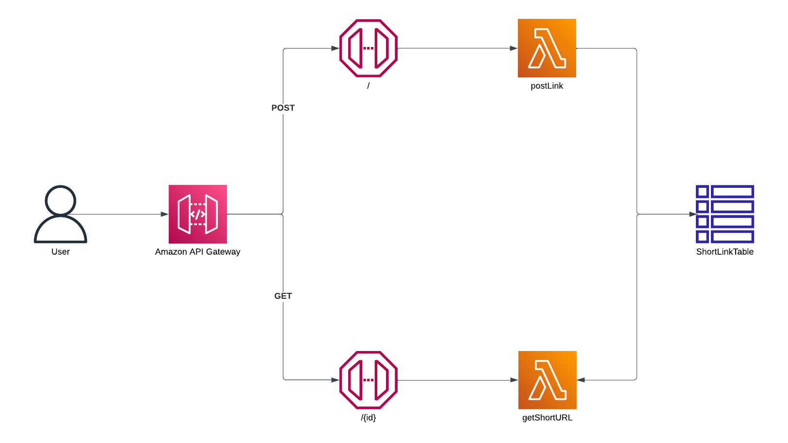

# Serverless URL shortener

## The Infrastructure

We used AWS API Gateway and AWS Lambda to create a RESTful API.

API Gateway is a fully managed service that enables us to create, publish, monitor, and secure APIs at any scale.

We used Lambda functions to handle requests received by the API Gateway endpoints.

The Lambda function for the POST endpoint generates a random short string and store the short URL and the associated external URL in DynamoDB.

The Lambda function for the GET endpoint retrieves the original URL from DynamoDB using the short URL and return a 302 redirect response to the client.

Here is the architecture we end up with at this point



To optimize the application for the following requirement :

- to handle traffic bursts
- minimize monthly costs
- secure the POST action so that only administrators can submit URLs

One possible approach to achieve these goals is to use AWS CloudFront with Lambda@Edge and DynamoDB Global Tables.

AWS CloudFront is a content delivery network that caches and delivers static and dynamic web content from edge locations worldwide, improving the performance of web applications. CloudFront can be configured to distribute traffic across multiple AWS regions, improving the availability and reliability of the application.

Lambda@Edge is a feature of AWS Lambda that allows executing Lambda functions at the edge locations of CloudFront. Lambda@Edge can be used to customize the content delivered by CloudFront, such as modifying HTTP headers, redirecting requests, or implementing authentication and authorization.

DynamoDB Global Tables is a managed service that provides automatic multi-region replication of DynamoDB tables, improving the availability and durability of data. Global Tables can be used to replicate the data across multiple AWS regions, improving the latency and reliability of the application.

Using CloudFront with Lambda@Edge and DynamoDB Global Tables, we can optimize the application as follows:

- Traffic bursts: CloudFront can cache the content of the application and serve it from the edge locations, reducing the load on the application servers. Lambda@Edge can be used to implement caching strategies, such as caching the responses of the GET requests for a configurable period.

- Cost optimization: CloudFront can reduce the bandwidth costs by caching the content and serving it from the edge locations. Lambda@Edge with DynamoDB Global Tables can be used to optimize the perfomance of each query by replicating the ShortLink Table accross multiple regions.

To protect the POST endpoint on API Gateway, we make use of API Gateway "Request-based" Authorizer. The 'Authorizer' is Lambda function that checks if the Authorization header is present and in the correct format (starting with "Bearer"). If the header is valid, it extracts the token and validates it (in this example, against the string 'admin'). If the token is valid, the function returns an allow response with a policy document that allows access to the requested resource.

Here is the architecture we end up with after optimization:


-------
## The Project

The endpoint(s) can be callable with a configurable custom URL, since having short URLs is a key business priority. That functionality would requires the use of AWS Route 53.

Amazon Route 53 is a highly available and scalable cloud-based domain name system (DNS) web service provided by Amazon Web Services (AWS).

It would require the purchase of a domain name. Therefore, in this project, the endpoint URL provided by API Gateway and the original Domain Name of the cloudfront Distribution are used. 

-------
### `POST` Create Short Link

Create an Account for the authenticated User if an Account for that User does
not already exist. Each User can only have one Account.

**URL** : `https://53kgr0gpw1.execute-api.us-east-1.amazonaws.com/beta/`

**Method** : `POST`

**Auth required** : YES

**Header constraints**

Provide a valid Bearer Token.

```json
{
  "Authorization": "Bearer admin"
}
```
_Note: For simplicity purposes, `admin` act as auhtnetication token. On a real project we expect this to be a full `JWT` token and have the Authorizer Lambda function decode it_

**Data constraints**

Provide a url to be shortened.

```json
{
  "url": "[url]"
}
```

**Data example** All fields must be sent.

```json
{
  "url": "https://battlefy.com/about"
}
```

## Success Response

**Condition** : If everything is OK and an ShortLink is created successfuly.

**Code** : `200 CREATED`

**Content example**

```json
{
  "shortlink": "https://53kgr0gpw1.execute-api.us-east-1.amazonaws.com/beta/iRLvAirnAgRd",
  "cdnShortLink": "https://dpclrrq07aujm.cloudfront.net/iRLvAirnAgRd"
}
```
_Note: `shortlink` return shortlink from the architecture_v1 and `cdnShortLink` return the shortlink from the architecture_v2_


-------
### `GET` Short Link Redirect (architecture_v1)

Create an Account for the authenticated User if an Account for that User does
not already exist. Each User can only have one Account.

**URL** : `https://53kgr0gpw1.execute-api.us-east-1.amazonaws.com/beta/${id}`

**Method** : `GET`

**Auth required** : NO

**Data example** All fields must be sent.

```json
{
  "url": "https://battlefy.com/about"
}
```

## Success Response

**Condition** : If shortlink ID is retrieved.

**Code** : `302 REDIRECTED`

-------
## The Deployment

A Github action will be trigger on push and then deploy the ALL cdk app to the AWS account specified by `AWS_ACCESS_KEY` and 
`AWS_SECRET_KEY` store in the GITHUB Repo setting secrets

_Note: the commented piece of code in `deployment.yaml`_